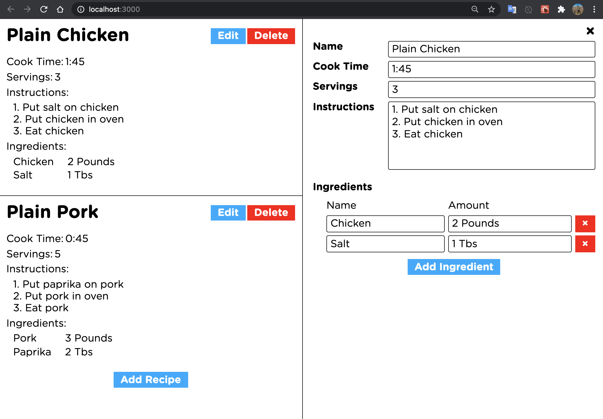

# Recipe Notebook With React

[Project Description](#project-description) | [Tech Stack](#tech-stack) | [Installation](#installation) | [Development Process](#development-process) | [User Stories](#user-stories) | [Further development](#further-development)

## Project Description

Created one page app with main functionality as a recipe notebook that allows user to add any recipe with appropriate ingredient list via UI. Recipe notebook functionality been done with React only.

## Tech Stack:

- [React](https://create-react-app.dev/docs/getting-started/) Create React App is an officially supported way to create single-page React applications. It offers a modern build setup with no configuration.

## Installation

- Clone this repository
  `$ git clone https://github.com/EdAncerys/cooking-with-react`
- Navigate to local repository
  `$ cd cooking-with-react`
- Install npm if you don't already have it
  `https://www.npmjs.com/get-npm`
- Install all dependencies
  `$ npm install`
- Start the server
  `$ npm start`
- Navigate to [http://localhost:3000](http://localhost:3000) in your browser

## Development Process

During development process I used an agile development methodologies of using git, commit messages, git branches, merges and regular code refactor.

## User UI view

<p align="center">
    
</p>

## User Stories

```
As a user,
So I can save my favorite recipe,
I am able to add new recipe.
```

```
As a user,
So I can customize my recipes,
I am able to edit my recipe list and all ingredients.
```

```
As a user,
So I can change my mind and do not display recipes I don't want to,
I am able to delete selected recipe.
```

## Further Development

Ideas to improve our application

- Add feature for user to be able to login.
- Add feature for a user to save recipes to DB.
- Add feature for a user to like/promote selected recipes.
- Add feature for a user to post/share favorites recipes to other platforms.

## Available Scripts

In the project directory, you can run:

### `npm start`

Runs the app in the development mode.<br />
Open [http://localhost:3000](http://localhost:3000) to view it in the browser.

The page will reload if you make edits.<br />
You will also see any lint errors in the console.

### `npm test`

Launches the test runner in the interactive watch mode.<br />
See the section about [running tests](https://facebook.github.io/create-react-app/docs/running-tests) for more information.

### `npm run build`

Builds the app for production to the `build` folder.<br />
It correctly bundles React in production mode and optimizes the build for the best performance.

The build is minified and the filenames include the hashes.<br />
Your app is ready to be deployed!

See the section about [deployment](https://facebook.github.io/create-react-app/docs/deployment) for more information.

### `npm run eject`

**Note: this is a one-way operation. Once you `eject`, you can’t go back!**

If you aren’t satisfied with the build tool and configuration choices, you can `eject` at any time. This command will remove the single build dependency from your project.

Instead, it will copy all the configuration files and the transitive dependencies (webpack, Babel, ESLint, etc) right into your project so you have full control over them. All of the commands except `eject` will still work, but they will point to the copied scripts so you can tweak them. At this point you’re on your own.

You don’t have to ever use `eject`. The curated feature set is suitable for small and middle deployments, and you shouldn’t feel obligated to use this feature. However we understand that this tool wouldn’t be useful if you couldn’t customize it when you are ready for it.
